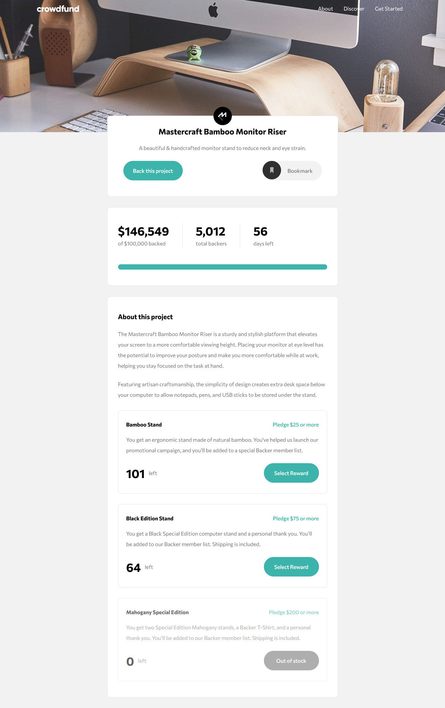

# Frontend Mentor - Crowdfunding product page solution

This is a solution to the [Crowdfunding product page challenge on Frontend Mentor](https://www.frontendmentor.io/challenges/crowdfunding-product-page-7uvcZe7ZR). Frontend Mentor challenges help you improve your coding skills by building realistic projects.

## Overview

### The challenge

Users should be able to:

- View the optimal layout depending on their device's screen size
- See hover states for interactive elements
- Make a selection of which pledge to make
- See an updated progress bar and total money raised based on their pledge total after confirming a pledge
- See the number of total backers increment by one after confirming a pledge
- Toggle whether or not the product is bookmarked

### Screenshot



### Links

- Solution URL: [Add solution URL here](https://www.frontendmentor.io/solutions/responsive-crowdfunding-product-site-yEKVQppNY)
- Live Site URL: [Add live site URL here](https://abubakarmana01.github.io/crowdfunding-product-page/)

### Built with

- Semantic HTML5 markup
- CSS custom properties
- Flexbox
- Mobile-first workflow

### What I learned

For the most part I just revised my knowloedge on HTML, CSS, JavaScript and improved my understanding of some higher order JS functions

```html
<h1>Some HTML code I'm proud of</h1>
```

```css
.proud-of-this-css {
	color: papayawhip;
}
```

```js
const proudOfThisFunc = () => {
	console.log('🎉');
};
```

### Continued development

I'll like to focus on building this with React JS. I'm currently working on my react skills

### Useful resources

- [Resource 1](https://www.w3schools.com) - This helped revise how to use some css properties like 'overflow: scroll' and a few others. I really liked this pattern and will use it going forward.
- [Resource 2](https://developer.mozilla.org/en-US/) - This is an amazing article which helped me undestand some properties of 'classList' and a few others in Vanilla JavaScript. I'd recommend it to anyone still learning this concept.

## Author

- Frontend Mentor - [@abubakarMana01](https://www.frontendmentor.io/profile/abubakarMana01)
- Twitter - [@abubakarMana1](https://www.twitter.com/abubakarMana1)
